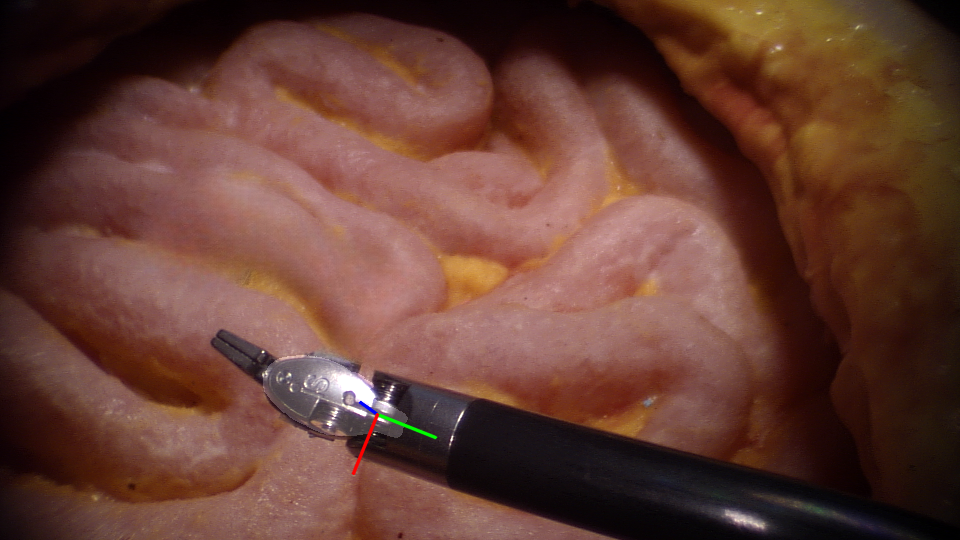

# SurgRIPETest



This is the official repository for the MICCAI 2023 SurgRIPE competition. The challenge is hosted [on Synapse](https://www.synapse.org/#!Synapse:syn51471789/wiki/622255).

The challange - 6 DOF pose estimation for surgical tools, with and without occulusion.

A docker image is required for submission to this challenge. Participants are expected to: (1) create a docker image; (2) download the SurgeRIPETest GitHub repository; (3) modify the model initislisation and the dataloading in sample.py.


## Docker

For participants of the MICCAI 2023 SurgRIPE challenge, a Docker Image is required for submission. Please visit [Docker Template](https://github.com/guyw04/SurgRIPE_docker) for more information.

For general docker help - [documentation](https://docs.docker.com).

## estimator.py
estimator.py contains the template of how to load your customized model and image preprocessing method. To run the estimator, please modify the following two functions **model_load()** [line #22] and **image_reader()** [line #13].

**model_load()** aims to load the model structure and weights.

**image_reader()** aims to read and process image given a image path.

## run.py
run.py contains the template of how to run the evaluation script. 

The model input is an RGB image and the required output should be a **4 X 3** matrix consisting of a rotation matrix(**R**) **3 X 3** and a translation matrix(**T**) **1 X 3**. The pose format should be the same as the GT pose, as shown in visualization.py.

### Usage

```bash
usage: python run.py [--path] [--type]

positional arguments:
Path                The path to root of the dataset
Type                The type of task l (LND) | m (MBF)
```

## evaluate.py
evaluate.py includes all the evaluateion metrics, including: ADD, Translation/Rotation Error, 2d projections, 5 mm 5-degree metric, etc.

## visualization.py
visualization.py includes the visualisation methods. Providing sample code for: how to read an image and annotation, how to decompose the 6DoF pose, how to show axis of pose, etc.
